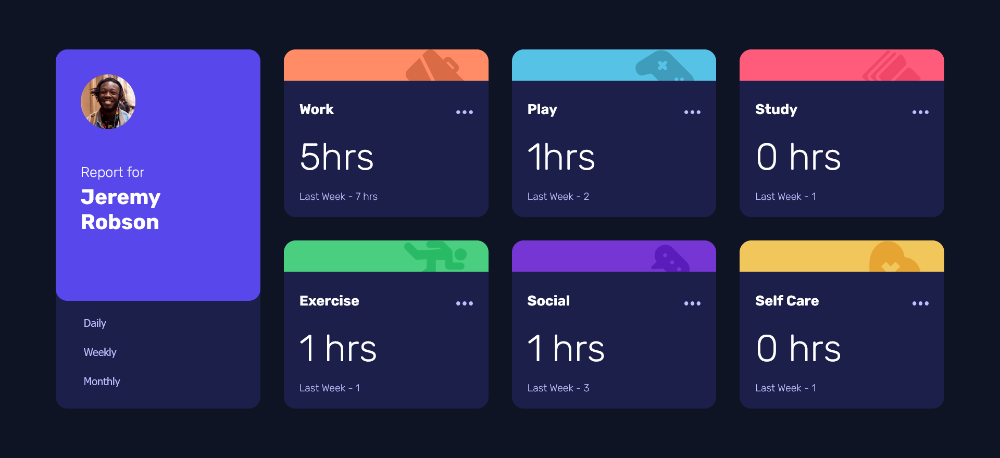

# Frontend Mentor - Time tracking dashboard solution

This is a solution to the [Time tracking dashboard challenge on Frontend Mentor](https://www.frontendmentor.io/challenges/time-tracking-dashboard-UIQ7167Jw). 

## Table of contents

- [Overview](#overview)
  - [The challenge](#the-challenge)
  - [Screenshot](#screenshot)
  - [Links](#links)
- [My process](#my-process)
  - [Built with](#built-with)
  - [What I learned](#what-i-learned)
  - [Continued development](#continued-development)
  - [Useful resources](#useful-resources)
- [Author](#author)
- [Acknowledgments](#acknowledgments)


## Overview

### The challenge

Users should be able to:

- View the optimal layout for the site depending on their device's screen size
- See hover states for all interactive elements on the page
- Switch between viewing Daily, Weekly, and Monthly stats

### Screenshot




### Links

- Solution URL: [Add solution URL here](https://your-solution-url.com)
- Live Site URL: [time-tracking-dashboard.netlify](https://frontendmentor-tracking-dashboard.netlify.app/)

## My process

### Built with

- Semantic HTML5 markup
- CSS custom properties
- CSS Grid
- Javascript


### What I learned

I learnt about fetch() API and how to work with JSON() file, serving data locally or through origin.
This course gives me insights of how to populating data without reloading the entire page, which ehance the peformance of a site

Here is an example:

```js
fetch(data.json) 
.then(response => {
  if(!response.ok) {
    throw new Error(`HTTP Error ${response.status}`)
  }

  return response.json();
})
.then(... )

```


### Continued development

I still need to work more on fetch() API and I to populate the data from it to the UI


### Useful resources

- [How to use promises:](https://developer.mozilla.org/en-US/docs/Learn/JavaScript/Asynchronous/Promises) - This helped me to understand how promises work. 
- [Fetching data from the server](https://developer.mozilla.org/en-US/docs/Learn/JavaScript/Client-side_web_APIs/Fetching_data) 
-[How To Use the filter() Array Method in JavaScript](https://www.digitalocean.com/community/tutorials/js-filter-array-method)


## Author

- Frontend Mentor - [@akin-holo](https://www.frontendmentor.io/profile/akin-holo)
- Twitter - [@AkinHolo](https://www.x.com/AkinHolo)

